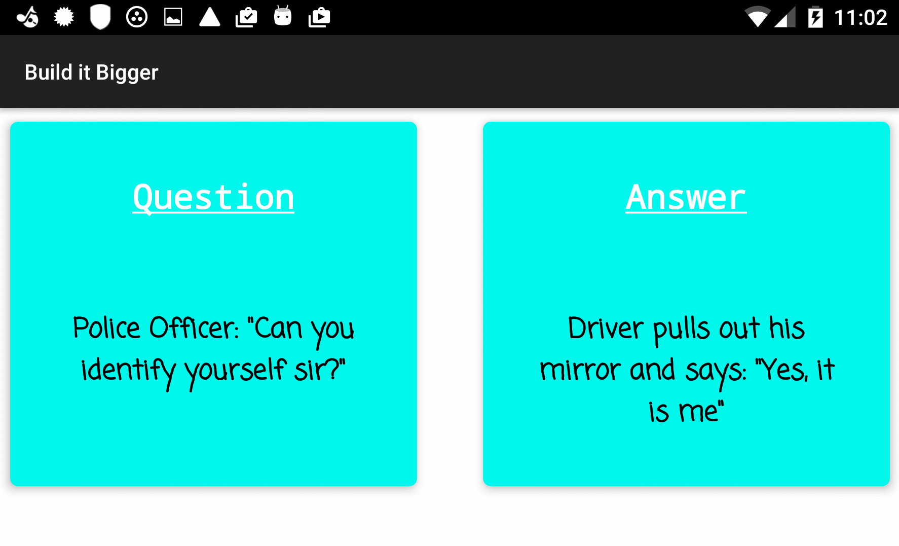

# Build-It-Bigger

An Android app with multiple flavors that uses multiple libraries and Google Cloud Endpoints. More specifically, it includes a Java library that provides jokes, a Google Cloud Endpoints(GCE) project that serves the jokes, an Android Library containing an activity for displaying jokes, and an Android app that fetches jokes from the GCE module and passes them to the Android Library for display.

## Why this project?
As Android projects grow in complexity, it becomes necessary to customize the behavior of the Gradle build tool, allowing automation of repetitive tasks. Particularly, factoring functionality into libraries and creating product flavors allow for much bigger projects with minimal added complexity. In addition, 
Gradle is used to add and set up the build to share code between the app's free and paid flavors and configure Gradle test tasks.
## Getting Started
The below instruction will get you a copy of the project up and running on your machine for development and testing purposes.

## Screenshots
### Portrait ##

 

### Landscape ###
   

### Prerequisites
Android Studio including SDK version 25 and build tools version 25.0.2.  
You can always update to the latest versions. 

### Running the tests
#### Gradle Test Task ####
You can run an automated Gradle test task that will hook up everything together including starting the backend (Launching the GCE local development server), running all tests, and shutting down the back end.  

`gradlew tieItAllTogether`  

#### Functional Tests ####
AsyncTask Instrumented Test - Checks whether the Async task successfully retrieves a non-empty string from the backend API.


### Installing and Deployment
1. Import the project to your Android Studio  
2. Build the project

In the `doInBackground` method of GetJokeFromBackEndTask class, change the **rootUrl** to include your local IP or use 10.0.2.2 if you are testing against an emulator. 

```java
MyApi.Builder builder = new MyApi.Builder(AndroidHttp.newCompatibleTransport(),
                    new AndroidJsonFactory(), null)
                    .setRootUrl("http:/my_computer_address:8080/_ah/api/")
                    .setGoogleClientRequestInitializer(new GoogleClientRequestInitializer() {
                        @Override
                        public void initialize(AbstractGoogleClientRequest<?> abstractGoogleClientRequest) throws IOException {
                            abstractGoogleClientRequest.setDisableGZipContent(true);
                        }
                    });
```

3. Select the backend run configuration and run it
2. Build the app and install the APK on your device or an emulator
                 
### Built With
[Android Studio](https://developer.android.com/studio/index.html) - The IDE used
[Gradle](https://gradle.org/) - Dependency Management

### Libraries Used
[EventBus](https://github.com/greenrobot/EventBus) - Communication between different components    
[Google API Client](https://developers.google.com/api-client-library/java/) - Accessing Google APIs from Java    
[Google Play Services Ads](https://developers.google.com/android/guides/setup) - Showing Ads in free version    

### Contributing 
Pull requests are gracefully accepted. 

### License
The project is licensed under the MIT License - see [LICENSE.txt](LICENSE.txt) file for details.

### Acknowledgments
Setting up the GCE [tutorial](https://github.com/GoogleCloudPlatform/gradle-appengine-templates/tree/master/HelloEndpoints)
